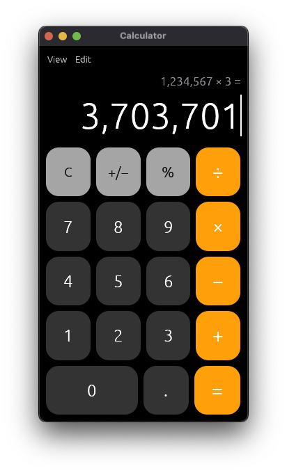
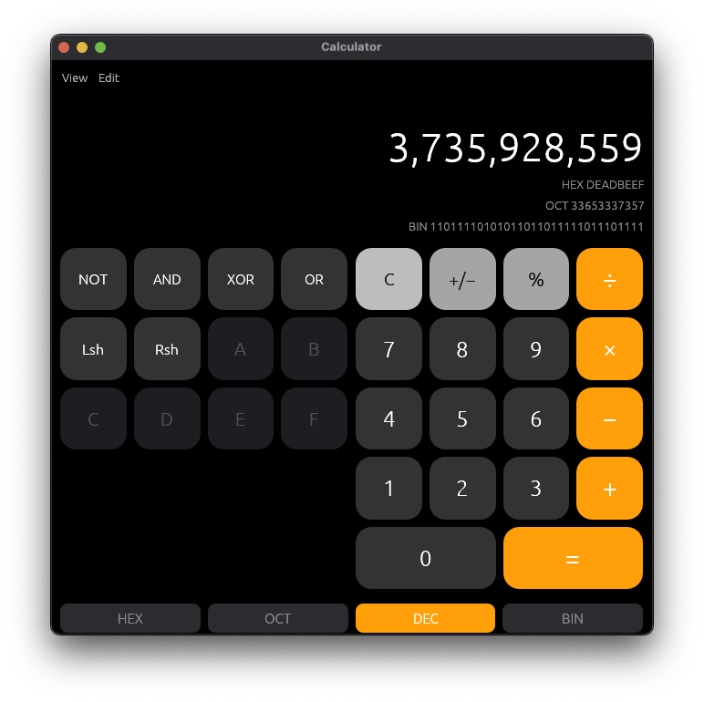
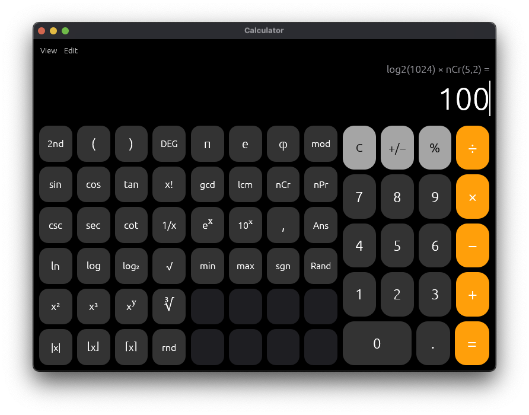
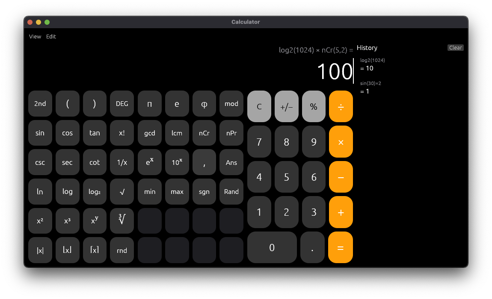

# Calculator

[](LICENSE)
[](https://github.com/skm-edu4/Calculator_in_rust/releases)
[](https://github.com/skm-edu4/Calculator_in_rust/releases)
[](https://www.rust-lang.org/)

A native calculator for **macOS, Windows, and Linux**, written in Rust with [egui](https://github.com/emilk/egui).
It combines a familiar desktop-calculator layout with a modern editing model: click anywhere in an
expression and edit it in place, type formulas straight from the keyboard, switch between Basic,
Scientific, and Programmer modes, and keep a searchable trail of your calculations.

**Download the latest build → [Releases](https://github.com/skm-edu4/Calculator_in_rust/releases)**

## Highlights

- **Caret (positional) editing** — click mid-expression to fix a typo instead of retyping the whole
  line. Backspace, Delete, Home/End, arrow keys, and Tab operand-slot cycling all operate at the caret.
- **Three modes, one window** — Basic, Scientific, and Programmer; each layout change snaps the
  window to its canonical size (300×540 / 780×560 / 660×630) while the window stays freely resizable.
- **Full scientific pad in three columns** — trigonometry with inverses (`2nd` key), `csc/sec/cot`,
  combinations and permutations, GCD/LCM, logarithms (incl. `log2`), roots, powers, `mod`, constants
  (`π e φ`), factorial, and `Ans`.
- **Type it or click it** — the parser accepts keyboard input such as `log2(8)`, `ncr(5,2)`, or
  `2^3^2` (right-associative) with the same semantics as the buttons.
- **Programmer mode** — HEX/DEC/OCT/BIN conversion with `AND OR XOR NOT` and shifts over wrapping
  64-bit integer arithmetic.
- **History panel** — toggleable per-window; every result is kept with the expression that produced it.
- **Safe by default** — division by zero and domain errors surface as a clear error state instead of
  `NaN`/`inf`; `factorial` and `nCr/nPr` are range-checked (0…170).
- **Consistent math typography** — `− × ÷` and superscripts render identically on every OS via an
  embedded STIX Two Math font fallback.

## Screenshots

<table>
  <tr>
    <td width="50%"><b>Basic</b><br></td>
    <td width="50%"><b>Programmer</b><br></td>
  </tr>
</table>

**Scientific**



**Scientific with history panel**



## Install

Prebuilt binaries for all three platforms are attached to every release:

| Platform | Archive | Notes |
|---|---|---|
| macOS (Apple Silicon + Intel) | `Calculator-macOS-universal.zip` | Universal binary, packaged as `Calculator.app` |
| Windows x64 | `Calculator-Windows-x64.zip` | GUI build — no console window |
| Linux x86-64 | `Calculator-Linux-x64.tar.gz` | Built against glibc 2.35 |

Latest release: **[v0.1.0](https://github.com/skm-edu4/Calculator_in_rust/releases/tag/v0.1.0)**

## Build from source

Requires [rustup](https://rustup.rs) (stable toolchain).

```bash
git clone https://github.com/skm-edu4/Calculator_in_rust.git
cd Calculator_in_rust
cargo run --release
```

### Quality gates

The project enforces zero warnings; run all three before pushing:

```bash
cargo fmt
cargo clippy --all-targets -- -D warnings
cargo test          # 78 tests, including ~212 trigonometric formula validations
```

### Cross-platform release builds

Core steps for each target (toolchain/container setup omitted; every artifact is verified
post-build with `lipo -info` / `file`, and the Linux binary with `objdump -T` for its glibc floor):

```bash
# macOS universal (arm64 + x86_64), then bundle and ad-hoc sign
cargo build --release --target aarch64-apple-darwin
cargo build --release --target x86_64-apple-darwin
lipo -create target/aarch64-apple-darwin/release/gui-calculator \
             target/x86_64-apple-darwin/release/gui-calculator \
      -o Calculator.app/Contents/MacOS/Calculator
codesign --force --deep --sign - Calculator.app

# Windows x64 — requires x86_64-w64-mingw32-gcc (mingw-w64) on PATH;
# -mwindows selects the GUI subsystem so no console window appears
RUSTFLAGS="-Clink-arg=-mwindows" cargo build --release --target x86_64-pc-windows-gnu

# Linux x86-64 — cross-build inside an Ubuntu 22.04 container (glibc 2.35 floor,
# confirmed against the shipped binary) with X11/xkbcommon dev packages installed
docker run --rm --platform linux/amd64 -v "$PWD":/app -w /app ubuntu:22.04 \
  bash -c "apt-get update && apt-get install -y curl gcc pkg-config libx11-dev \
  libxkbcommon-dev libxcb1-dev libwayland-dev && curl https://sh.rustup.rs -sSf \
  | sh -s -- -y --profile minimal && . ~/.cargo/env \
  && cargo build --release --target x86_64-unknown-linux-gnu"
```

## Keyboard

| Key | Action |
|---|---|
| digits, `.`, `+ - * / ^ %`, `( )` | insert at caret |
| `Enter` / `=` | evaluate |
| `Esc` | clear all (AC) |
| `Backspace` / `Delete` | remove before / at caret |
| `← →`, `Home`, `End` | move caret |
| `Tab` | jump to next operand slot |
| `Cmd/Ctrl+C`, `Cmd/Ctrl+V` | copy / paste (paste accepts plain numbers) |
| letters | type function names: `sin(30)`, `log2(8)`, `ncr(5,2)`, … |

## Project layout

```
src/main.rs              # evaluation engine, parser, display maps, UI, and tests — one crate, one file
assets/STIXTwoMath.otf   # embedded math glyph fallback font (SIL OFL 1.1)
docs/                    # screenshots used in this README
Cargo.toml               # single direct dependency: eframe 0.36
```

Internally the app keeps the **expression string as the source of truth** and a caret index over it;
a display mapper layers digit grouping and math glyphs on top with a bidirectional index map, so the
caret stays correct even when the rendered text differs from the stored one. Evaluation is two-stage:
lenient while you type (half-finished expressions render), strict when you press `=` (errors become an
explicit error state).

## License

This project is released under the [MIT License](LICENSE).

Third-party components:

| Component | License |
|---|---|
| [eframe / egui](https://github.com/emilk/egui) — UI framework | MIT OR Apache-2.0 |
| [winit](https://github.com/rust-windowing/winit) — windowing (via egui) | MIT OR Apache-2.0 |
| STIX Two Math font (embedded in `assets/`) | [SIL Open Font License 1.1](https://scripts.sil.org/OFL) |

See individual crates for their full license texts.
